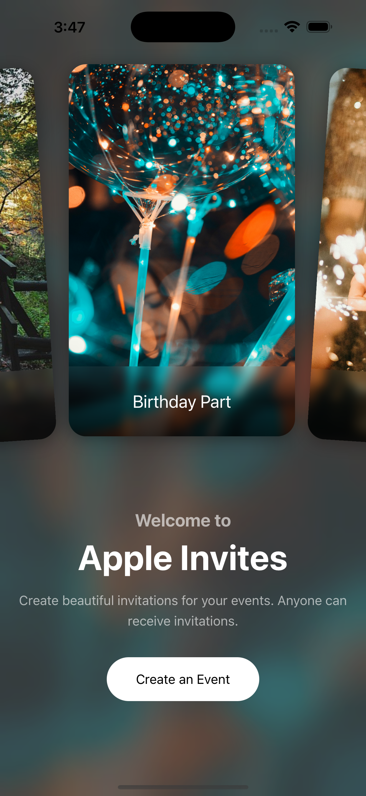
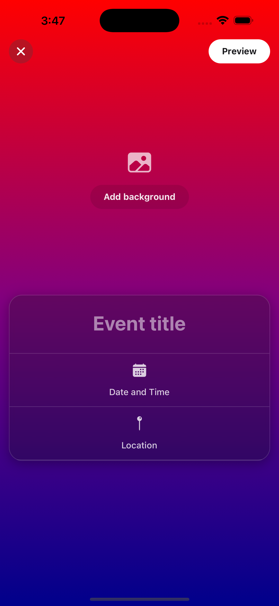

# Apple Invites - React Native App

A sleek and interactive **invitation app** inspired by Apple's design aesthetics. Built with **React Native**, this app allows users to create, send, and manage event invitations effortlessly.

## 🎉 Features

- 📅 **Create & Manage Invitations**
- 📩 **Send Invites to Contacts**
- ✅ **Track RSVP Responses**
- 🎨 **Apple-like UI/UX**
- 📱 **Cross-Platform Compatibility (iOS & Android)**
- ⚡ **Optimized Performance**

## 🛠 Tech Stack

- **React Native** – Cross-platform mobile app development
- **Expo** – Simplifies development & deployment
- **Firebase** – Backend services for authentication & data management
- **React Navigation** – Smooth screen transitions
- **Reanimated & Gesture Handler** – Fluid animations & gestures

## 🚀 Installation & Setup

1. **Clone the repository:**
   ```sh
   git clone https://github.com/shoaibarif244/AppleInvites.git
   cd AppleInvites
   ```
2. **Install dependencies:**
   ```sh
   npm install  # or yarn install
   ```
3. **Run the app:**
   ```sh
   npx expo start
   ```
4. **Open in a Simulator or Device:**
   - Scan the QR code using the **Expo Go** app (iOS & Android)
   - Use an emulator (Xcode for iOS, Android Studio for Android)

## 📷 Screenshots




## 📌 Roadmap

- [ ] Push notifications for invites
- [ ] Deep linking for invitation responses
- [ ] Enhanced animations and gesture support

## 🤝 Contributing

Contributions are welcome! Fork the repo, create a branch, and submit a pull request.

## 🛠 Issues & Support

For issues or suggestions, open an issue in the GitHub repository.

## 📄 License

This project is open-source and available under the [MIT License](LICENSE).

---

**Developed with ❤️ by [shoaibarif244](https://github.com/shoaibarif244)**
